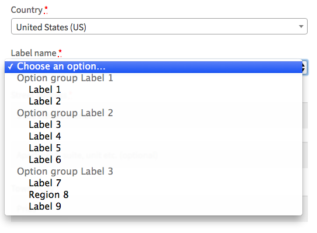

<strong>Add select field with optgroup new field type to WooCommerce form fields</strong>

The select options should be a multidimensional array like:

<pre><code>$options = [
    '' => __("Choose an option…"),
    __("Option group Label 1") => [
        'option-1' 	=> __("Label 1"),
	'option-2' 	=> __("Label 2"),
    ],
    __("Option group Label 2") => [
        'option-3' 	=> __("Label 3"),
        'option-4' 	=> __("Label 4"),
        'option-5' 	=> __("Label 5"),
        'option-6' 	=> __("Label 6"),
    ],
    __("Option group Label 3")  => [
        'option-7' 	=> __("Label 7"),
        'option-8' 	=> __("Label 8"),
        'option-9' 	=> __("Label 9"),
    ],
];
</code></pre>

<strong>USAGE example code snippet on Woocommerce checkout billing fields:</strong>

<pre><code>add_filter('woocommerce_checkout_fields', 'checkout_select_field_with_optgroup', 10, 1 );
function checkout_select_field_with_optgroup( $fields ) {
	
    $options = [
        '' => __("Choose an option…"),
	__("Option group Label 1") => [
	    'option-1' 	=> __("Label 1"),
	    'option-2' 	=> __("Label 2"),
	],
	__("Option group Label 2") => [
	    'option-3' 	=> __("Label 3"),
	    'option-4' 	=> __("Label 4"),
	    'option-5' 	=> __("Label 5"),
	    'option-6' 	=> __("Label 6"),
	],
	__("Option group Label 3")  => [
	    'option-7' 	=> __("Label 7"),
	    'option-8' 	=> __("Label 8"),
	    'option-9' 	=> __("Label 9"),
	],
    ];
	
    $fields['billing']['billing_custom'] = array(
        'type'     => 'select_og', // <== Type 
        'label'    => __("Label name"),
        'class'    => array( 'form-row-wide' ),
        'required' => true,
        'options'  => $options,
        'clear'    => true,
    );
    
    return $fields;
}
</code></pre>

